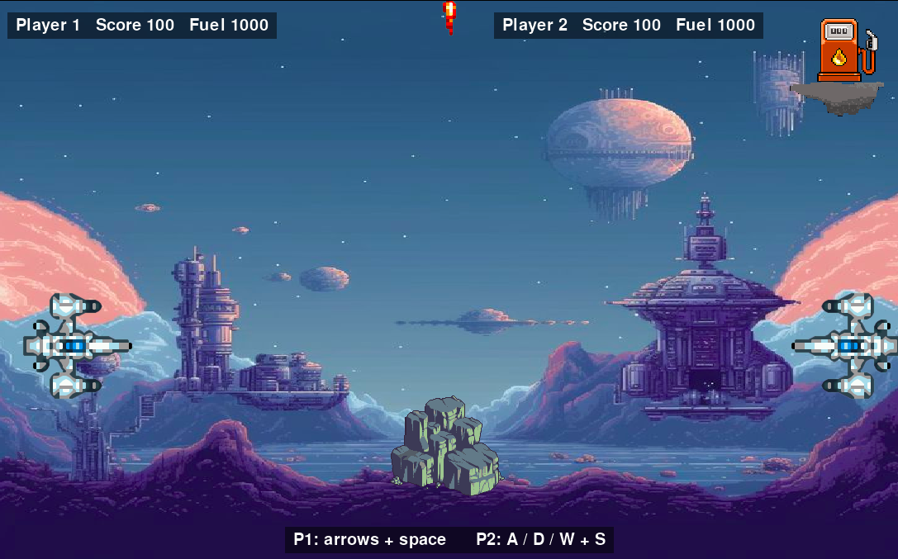

# Space Game

A two-player arcade game built with Python and pygame. Fly your ship with gravity and thrust, dodge the rock's fire, shoot your opponent, and refuel at the charging station.

 -->

## Run it
Requires Python 3.9+.

```bash
pip install -r requirements.txt
python3 main.py
```

## Controls
| | Rotate | Thrust | Fire |
|---|---|---|---|
| **Player 1** (left) | ← / → | ↑ | Space |
| **Player 2** (right) | A / D | W | S |

Press **R** to restart after a game and **Esc** to quit.

## Rules
- Both players start with 100 score and 1000 fuel. Thrusting burns fuel, and gravity pulls you down.
- Touch the charging station (top right) to gain 10 score and refuel. It works once every 5 seconds per player.
- Getting hit by a bullet, from the rock or from your opponent, costs 10 score. Your own bullets never hurt you.
- Reach **150 score** to win, or bring your opponent down to **0**.

All gameplay numbers live in `settings.py`, so they are easy to tweak.

## Project structure
```
main.py       game loop, input, collisions, HUD
ship.py       Ship: movement, fuel, shooting
sprites.py    Bullet, Obstacle, ChargingStation, image loading
settings.py   constants
assets/       images
```


